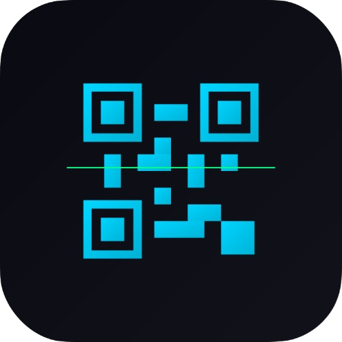

# Code Scanner

<p align="center">
  
</p>

A Flutter app for scanning QR codes and barcodes.

## 📱 Features

- 🔍 **QR Code & Barcode Scanning** - Fast and accurate code detection
- 📜 **Scan History** - Automatically saves all scanned data
- ⏰ **Timestamp** - Records when each code was scanned
- 🏷️ **Code Type Labels** - Visual distinction between QR CODE and BARCODE
- 📋 **Copy to Clipboard** - One-tap copy functionality
- 🗑️ **Delete History** - Remove individual scan results
- 📱 **iOS & Android** - Cross-platform support

## 🎨 Design

- Dark theme (Cyberpunk style)
- Monospace font throughout
- Glow effects and smooth animations
- Intuitive, minimalist UI

## 🚀 Getting Started

### Requirements
- Flutter 3.0+
- iOS 11.0+ / Android API 21+

### Setup

```bash
# Clone the repository
cd code-scanner

# Install dependencies
flutter pub get

# For iOS (Mac only)
cd ios && pod install && cd ..

# Run the app
flutter run

# Run in release mode (faster)
flutter run --release
```

## 📦 Build

### iOS
```bash
flutter build ios --release
```

### Android
```bash
flutter build apk --release
# or
flutter build appbundle --release
```

## 📁 Project Structure

```
lib/
├── main.dart                      # App entry point
├── models/
│   └── scan_result.dart           # Scan result data model
├── screens/
│   ├── home_screen.dart           # Home screen (history list)
│   ├── scan_screen.dart           # Scanner screen
│   └── detail_screen.dart         # Detail screen
├── services/
│   └── scan_history_service.dart  # History management service
└── theme/
    └── app_theme.dart             # App theme configuration
```

## 🔒 Permissions

### iOS
- Camera (for QR/Barcode scanning)

### Android
- Camera (for QR/Barcode scanning)

## 📄 License

MIT License
